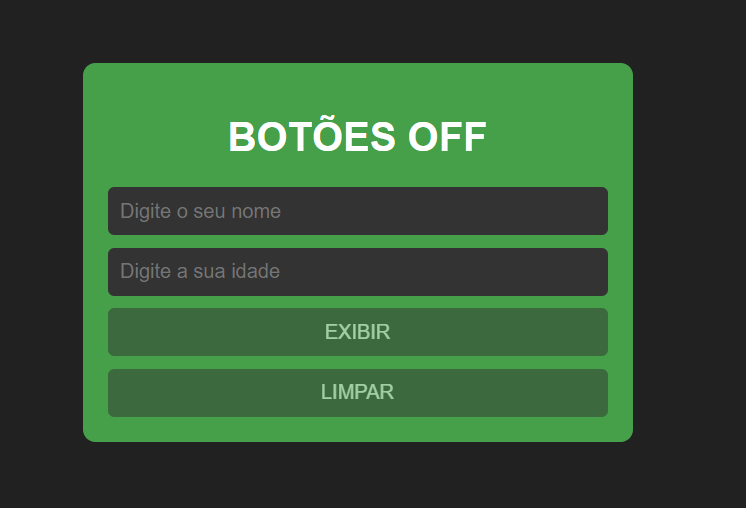
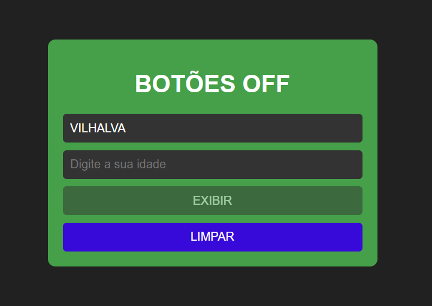
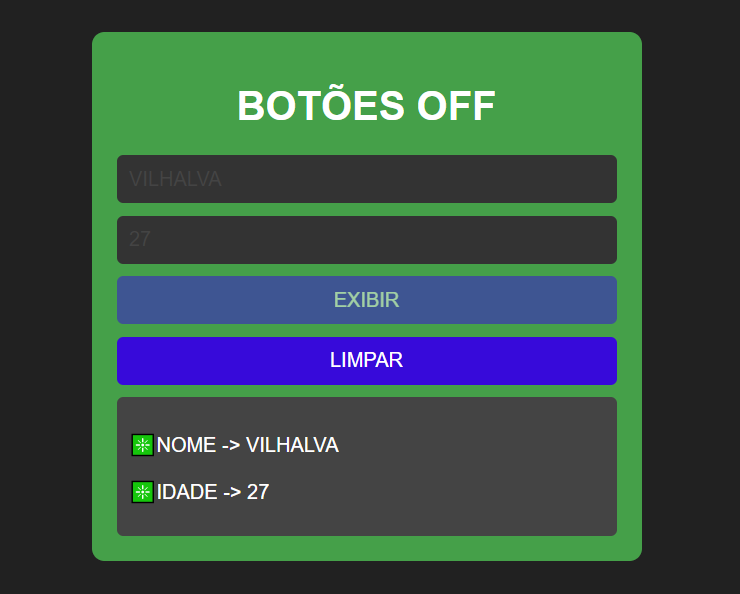

# BOTOES DESABILITADOS
🔐APRENDA A HABILITAR E DESABILITAR OS BOTÕES E CAMPOS DO SEU FORMULÁRIO HTML, CSS E JAVASCRIPT PARA VALIDAÇÃO! 

 <br><br>
 <br><br>
 <br>

## DESCRIÇÃO E RECURSOS:
Este é um aplicativo simples que permite ao usuário inserir seu nome e idade em campos de texto. Quando os campos estão preenchidos, os botões `EXIBIR` e `LIMPAR` são habilitados. Ao clicar em `EXIBIR`, os dados inseridos são exibidos abaixo do formulário e o botão `EXIBIR` é desabilitado temporariamente para evitar cliques repetidos. Além disso, o botão `LIMPAR` será habilitado apenas se ambos os campos (nome e idade) estiverem preenchidos. Se o campo de nome contiver números ou se qualquer um dos campos estiver vazio, o botão `LIMPAR` será desabilitado.

1. **Entrada de Usuário:** O usuário pode inserir seu nome e idade nos campos de texto fornecidos.
2. **Botões Habilitados:** Os botões `EXIBIR` e `LIMPAR` são habilitados apenas quando ambos os campos (nome e idade) estão preenchidos.
3. **Feedback Visual:** Os botões mudam de estilo (cor) quando estão habilitados para indicar que podem ser clicados.
4. **Exibição de Dados:** Quando o usuário clica no botão `EXIBIR`, os dados inseridos (nome e idade) são exibidos abaixo do formulário. Além disso, o botão `EXIBIR` é temporariamente desabilitado para evitar cliques repetidos. O botão `LIMPAR` será habilitado apenas se ambos os campos (nome e idade) estiverem preenchidos. Se o campo de nome contiver números ou se qualquer um dos campos estiver vazio, o botão `LIMPAR` será desabilitado.

## MINICURSO:
### O QUE É UM BOTÃO DESABILITADO?
Um botão desabilitado em um formulário web é um botão que é incapaz de ser clicado ou interagido enquanto certas condições não forem atendidas. Ele geralmente é usado para evitar a submissão de dados incompletos ou inválidos, garantindo que o usuário preencha todos os campos necessários antes de prosseguir.

### COMO COLOCAR UM BOTÃO DESABILITADO?
1. **Defina o botão como desabilitado:**
   Isso é feito no código HTML, geralmente usando o atributo `disabled`. Por exemplo:
   ```html
   <button type="submit" id="submitBtn" disabled>Enviar</button>
   ```

2. **Habilite o botão quando as condições necessárias forem atendidas:**
   Isso é geralmente feito usando JavaScript. Você pode adicionar ou remover o atributo `disabled` com base nas ações do usuário. Por exemplo:
   ```javascript
   document.getElementById('submitBtn').disabled = false; // Habilita o botão
   ```

### HABILITAR E DESABILITAR BOTÕES E CAMPOS:
Para habilitar e desabilitar os botões e campos de entrada, usamos a propriedade `disabled` do HTML. Quando definimos `disabled` como `true`, o elemento fica desabilitado, o que significa que não pode ser clicado ou editado pelo usuário. Quando definimos como `false`, o elemento fica habilitado.

No JavaScript, acessamos os elementos utilizando `document.getElementById()` e atribuímos `true` ou `false` à propriedade `disabled` conforme a lógica de validação. Por exemplo, para desabilitar o botão de exibição quando o campo de nome ou idade estiver vazio, usamos:

```javascript
exibirButton.disabled = !isNameFilled || !isAgeFilled;
```

E para habilitar o botão de limpar quando ambos os campos estiverem preenchidos, usamos:

```javascript
limparButton.disabled = !isNameFilled || !isAgeFilled;
```

### MUDAR COR DE ESTILO PARA VALIDAÇÃO:
Para mudar a cor de estilo dos campos de entrada quando estão desabilitados, podemos definir a cor de texto diretamente no JavaScript. Por exemplo, quando desabilitamos os campos após clicar no botão "Exibir", podemos alterar a cor de texto para cinza. Isso é feito com o seguinte código:

```javascript
nameInput.style.color = '#444'; 
ageInput.style.color = '#444'; 
```

E quando habilitamos os campos novamente, após clicar no botão "Limpar", restauramos a cor original:

```javascript
nameInput.style.color = '#fff'; 
ageInput.style.color = '#fff'; 
```

### PARA QUE SERVE BOTÃO E CAMPO DESABILITADOS?
1. **Validação de Formulário:**
   Um botão desabilitado pode ser usado para garantir que todos os campos obrigatórios em um formulário sejam preenchidos antes que o formulário possa ser enviado.

2. **Prevenção de Ações Prematuras:**
   Em certos casos, como em um jogo ou uma etapa de um processo, um botão desabilitado pode impedir que o usuário execute uma ação antes que esteja pronto ou antes que todas as condições necessárias sejam atendidas.

3. **Melhoria da Experiência do Usuário:**
   O uso de botões desabilitados ajuda a orientar e direcionar o usuário, indicando visualmente quais ações são possíveis ou permitidas em determinado momento.

4. **Redução de Erros:**
   Ao evitar que o usuário envie um formulário com campos obrigatórios em branco ou com dados inválidos, os botões desabilitados ajudam a reduzir erros e retrabalhos.

### CONCLUSÃO:
- A propriedade `disabled` é usada para habilitar ou desabilitar botões e campos de entrada.
- No JavaScript, atribuímos `true` ou `false` à propriedade `disabled` com base na lógica de validação.
- Podemos alterar a cor de texto dos campos de entrada diretamente no JavaScript usando a propriedade `style.color`.

Essas são as principais técnicas utilizadas para habilitar, desabilitar e alterar estilos de elementos HTML dinamicamente com JavaScript em resposta a eventos e validações.

Os botões desabilitados são uma parte importante da interface de usuário em formulários web, ajudando a melhorar a usabilidade e a evitar erros. Ao definir a disponibilidade de botões com base em condições específicas, os desenvolvedores podem criar uma experiência mais intuitiva e eficiente para os usuários.

## COMO USAR?
### BAIXANDO O PROJETO:
* Clone o repositório para o seu sistema local:

```bash
git clone https://github.com/VILHALVA/BOTOES-DESABILITADOS.git
```

* Navegue até o diretório do projeto.

```bash
cd BOTOES-DESABILITADOS
```

* Descompacte o arquivo ZIP (se você baixou manualmente):

```bash
unzip BOTOES-DESABILITADOS.zip
``` 

### EXECUTANDO O PROJETO:
1. Abra o arquivo `CODIGO.html` em seu navegador de preferência.
2. Insira seu nome e idade nos campos de texto fornecidos.
3. Os botões `EXIBIR` e `LIMPAR` estarão desabilitados até que ambos os campos (nome e idade) sejam preenchidos.
4. Assim que ambos os campos forem preenchidos, os botões `EXIBIR` e `LIMPAR` ficarão habilitados.
5. Clique em `EXIBIR` para exibir os dados inseridos abaixo do formulário. O botão `EXIBIR` será temporariamente desabilitado para evitar cliques repetidos.
6. Clique em `LIMPAR` para limpar os campos e ocultar os dados exibidos. O botão `LIMPAR` será habilitado apenas se ambos os campos (nome e idade) estiverem preenchidos. Se o campo de nome contiver números ou se qualquer um dos campos estiver vazio, o botão `LIMPAR` será desabilitado.

## NÃO SABE?
- Entendemos que para manipular arquivos em `HTML`, `CSS` e outras linguagens relacionadas, é necessário possuir conhecimento nessas áreas. Para auxiliar nesse aprendizado, oferecemos cursos gratuitos disponíveis:
* [Curso de HTML e CSS](https://github.com/VILHALVA/CURSO-DE-HTML-E-CSS)
* [Curso de JavaScript](https://github.com/VILHALVA/CURSO-DE-JAVASCRIPT)
* [Confira mais cursos](https://github.com/VILHALVA?tab=repositories&q=+topic:CURSO)

## CREDITOS:
- [ESSE MINICURSO E PROJETO FOI CRIADO PELO VILHALVA](https://github.com/VILHALVA)
- [ESTÁ DISPONIVEL NO SITE](https://vilhalva.github.io/STYLER/STYLER.html)

